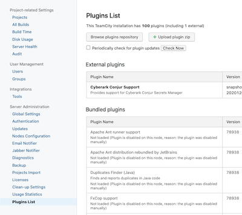
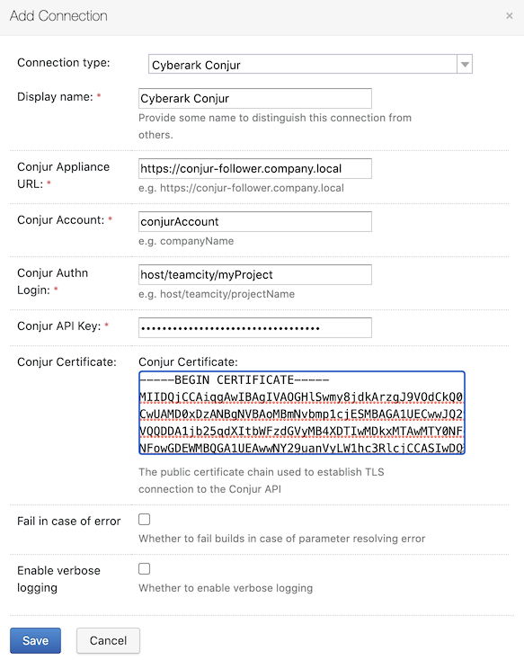
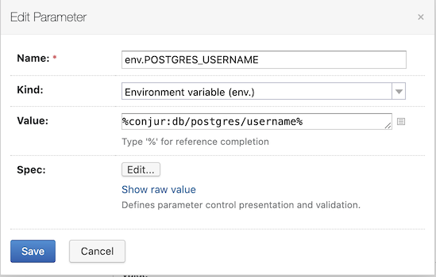

# TeamCity Plugin for CyberArk Conjur
This plugin allows connecting TeamCity to CyberArk Conjur to retrieve credentials for TeamCity build scripts.

## Certification level

This repo is a **Community** level project. It's a community contributed project that **is not reviewed or supported
by CyberArk**. For more detailed information on our certification levels, see [our community guidelines](https://github.com/cyberark/community/blob/master/Conjur/conventions/certification-levels.md#community).

## Requirements

- Conjur OSS v1+
- DAP v10+

## Usage instructions

Download the TeamCity plugin from [here](https://github.com/cyberark/conjur-teamcity-plugin/releases).

Install the TeamCity plugin in the administration settings:

Configure the `Cyberark Conjur` Connection in the project settings:

Configure the `conjur` parameter in the project or build settings:

When the TeamCity project builds, it will retrieve the configured `conjur` parameters at runtime and set them in the build script's environment. 
The secrets retrieved from Conjur will be scrubbed from the build output.

## Contributing

We welcome contributions of all kinds to this repository. For instructions on how to get started and descriptions
of our development workflows, please see our [contributing guide](CONTRIBUTING.md).

## License

Copyright (c) 2020 CyberArk Software Ltd. All rights reserved.

Licensed under the Apache License, Version 2.0 (the "License");
you may not use this file except in compliance with the License.
You may obtain a copy of the License at

   http://www.apache.org/licenses/LICENSE-2.0

Unless required by applicable law or agreed to in writing, software
distributed under the License is distributed on an "AS IS" BASIS,
WITHOUT WARRANTIES OR CONDITIONS OF ANY KIND, either express or implied.
See the License for the specific language governing permissions and
limitations under the License.

For the full license text see [`LICENSE`](LICENSE).
